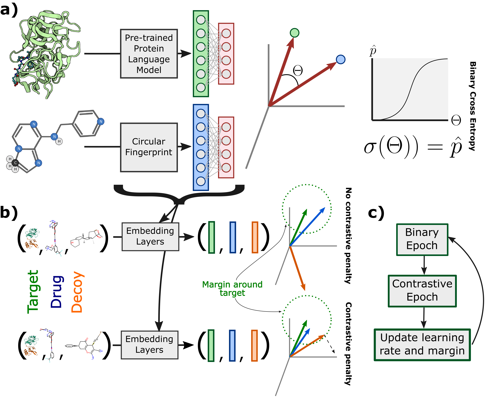

# 🚧🚧🚧 Currently under construction, you can access development code at [ConPLex_dev](https://github.com/samsledje/ConPLex_dev) 🚧🚧🚧

# ConPLex



[](https://github.com/samsledje/ConPLex/releases)
[](https://pypi.org/project/conplex-dti/)
[](https://conplex.readthedocs.io/en/main/?badge=main)
[](https://github.com/samsledje/ConPLex/blob/main/LICENSE)
[](https://github.com/psf/black)

 - [Homepage](http://conplex.csail.mit.edu)
 - [Documentation](https://d-script.readthedocs.io/en/main/)

## Abstract
Sequence-based prediction of drug-target interactions has the potential to accelerate drug discovery by complementing experimental screens. Such computational prediction needs to be generalizable and scalable while remaining sensitive to subtle variations in the inputs. However, current computational techniques fail to simultaneously meet these goals, often sacrificing performance on one to achieve the others. We develop a deep learning model, ConPLex, successfully leveraging the advances in pre-trained protein language models ("PLex") and employing  a novel  protein-anchored contrastive co-embedding ("Con") to outperform state-of-the-art approaches. ConPLex achieves high accuracy, broad adaptivity to unseen data, and specificity against decoy compounds. It makes predictions of binding based on the distance between learned representations, enabling predictions at the scale of massive compound libraries and the human proteome. Experimental testing of 19 kinase-drug interaction predictions validated 12 interactions, including four with sub-nanomolar affinity, plus a novel strongly-binding EPHB1 inhibitor ($K_D = 1.3nM$). Furthermore, ConPLex embeddings are interpretable, which enables us to visualize the drug-target embedding space and use embeddings to characterize the function of human cell-surface proteins. We anticipate ConPLex will facilitate novel drug discovery by making highly sensitive in-silico drug screening feasible at genome scale.

## Installation

### Install from PyPI
-----------------

```
$ pip install conplex-dti
```

### Compile from Source
-------------------

```
$ git clone https://github.com/samsledje/ConPLex.git
$ cd ConPLex
$ conda env create -n conplex python=3.9 poetry=1.4
$ poetry install
```

## Usage


## Reference
If you use ConPLex, please cite [“Contrastive learning in protein language space predicts interactions between drugs and protein targets”](https://www.biorxiv.org/content/10.1101/2022.12.06.519374v1) by Rohit Singh*, Samuel Sledzieski*, Bryan Bryson, Lenore Cowen and Bonnie Berger, currently in press at PNAS.

```
TBD .bibtex citation
```
